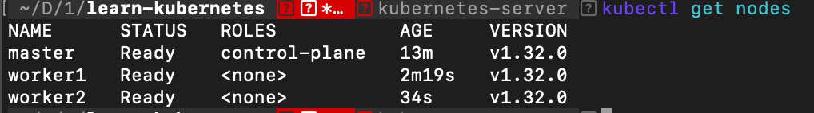

# Giới thiệu và Cài đặt Kubernetes Cluster

## Kubernetes là gì?

Kubernetes (còn gọi là k8s) là một nền tảng mã nguồn mở dùng để tự động triển khai, quản lý và mở rộng các ứng dụng container. Nó giúp tổ chức các container thành các nhóm (cluster) và cung cấp các công cụ để quản lý tài nguyên, cân bằng tải, và đảm bảo ứng dụng luôn hoạt động ổn định. Kubernetes giúp giảm công sức quản trị hệ thống, đặc biệt khi ứng dụng phức tạp hoặc cần mở rộng quy mô.

## Kiến trúc của Kubernetes


## Chuẩn bị môi trường

1. VMware Fusion 13.6.2
2. Docker Desktop

### Cài đặt máy ảo VMware Fusion

**Chú ý**
Mình chạy trên Mac Mini M4. 
Trên VirtualBox, hiện tại chưa hỗ trợ Centos 7 chạy trên chip Apple silicon ARM.
Vì thế bạn phải cài đặt VMware fusion để cài máy ảo Ubuntu 22.04 arm64

Link tham khảo [Install VMware Fusion on Mac](
https://sloopstash.com/knowledge-base/how-to-install-vmware-fusion-on-mac.html)
1. Đăng kí tài khoản [Broadcom support portal](https://support.broadcom.com/web/ecx/home)
2. Đăng nhập vào Broadcom support và di chuyển đến trang [VMware Fusion downloads](https://support.broadcom.com/group/ecx/productdownloads?subfamily=VMware+Fusion) để download VMware Fusion version 13.6.2
3. Cài đặt VMware Fusion trên Mac


### Tạo Cluster Kubernetes từ Docker Desktop

1. Cài đặt [Docker Desktop](https://docs.docker.com/desktop/setup/install/mac-install/)
2. Trong Setting của Docker Desktop Dashboard, [Enable Kubernetes](https://docs.docker.com/desktop/features/kubernetes/)
3. Kiểm tra Kuberneste
```
# Lấy thông tin Cluster
kubectl cluster-info

# Các Node có trong Cluster
kubectl get nodes
```

### Tạo Cluster Kubernetes với 1 node master, 2 node worker
Thông tin các máy ảo như bên dưới
| Hostname | Thông tin hệ thống                                     | Vai trò |
| -------- | ------------------------------------------------------ | ------- |
| master   | ubuntu-22.04, containerd, Kubernetes. IP 172.16.11.100 | master  |
| worker1  | ubuntu-22.04, containerd, Kubernetes. IP 172.16.11.101 | worker  |
| worker2  | ubuntu-22.04, containerd, Kubernetes. IP 172.16.11.102 | worker  |
| rancher  | ubuntu-22.04, Docker CE, Kubernetes. IP 172.16.11.103  | rancher |

**Chú ý**
Máy ảo rancher để cuối cùng cài đặt Rancher. Hiện tại thì chưa cần cài đặt.

### Cài đặt Container.d and Kubernetes trong Ubuntu 22.04
Nguồn tham khảo: https://github.com/feliux/containers-lab/tree/master/k8s/tools
Sử dụng bash từ [setup-containerd.sh](https://github.com/feliux/containers-lab/blob/master/k8s/tools/setup-containerd.sh) và [setup-kubetools.sh](https://github.com/feliux/containers-lab/blob/master/k8s/tools/setup-kubetools.sh)

### Tạo node master kubernetes
```
cd kubernetes-server/master/
vagrant up
```

Thông tin của node master được cấu hình trong file `kubernetes-server/master/Vagrantfile`

```ruby 
# -*- mode: ruby -*-
# vi: set ft=ruby :

Vagrant.configure("2") do |config|
  config.vm.box = "bento/ubuntu-22.04-arm64"
  config.vm.network "private_network", ip: "172.16.11.100"
  config.vm.hostname = "master.xtl"

  config.vm.provider "libvirt" do |vb|
     vb.name = "master.xtl"
     vb.cpus = 3
     vb.memory = "3096"
     vb.gui = true
  end

  config.vm.provision "shell", path: "./../setup-container.sh"
  config.vm.provision "shell", path: "./../setup-kubetools.sh"

  config.vm.provision "shell", inline: <<-SHELL

    echo "root password"
    # # Centos
    # echo "123" | passwd --stdin root
    # # Ubuntu
    echo 'root:123' | sudo chpasswd

    # # Centos
    # sed -i 's/^PasswordAuthentication no/PasswordAuthentication yes/' /etc/ssh/sshd_config
    cat >>/etc/ssh/sshd_config<<EOF
PermitRootLogin yes
PasswordAuthentication yes
EOF
    systemctl reload sshd

cat >>/etc/hosts<<EOF
172.16.11.100 master.xtl
172.16.11.101 worker1.xtl
172.16.11.102 worker2.xtl
EOF

  SHELL
end
```

Trong node `master` đã cài đặt
1. [containerd](kubernetes-server/setup-container.sh)
2. [kubernetes](kubernetes-server/setup-kubetools.sh)
3. Đổi password của root thành `123` và setting các hostname của master, worker1, worker2

#### Khởi tạo cluster
```
kubeadm init --apiserver-advertise-address=172.16.11.100 --pod-network-cidr=192.168.0.0/16
```


Sau khi khởi tạo cluster, cần tạo folder và các file cấu hình của kubernetes
```
mkdir -p $HOME/.kube
sudo cp -i /etc/kubernetes/admin.conf $HOME/.kube/config
sudo chown $(id -u):$(id -g) $HOME/.kube/config
```

#### Cài đặt plugin mạng calico sử dụng bởi các Pod
```
kubectl apply -f https://raw.githubusercontent.com/projectcalico/calico/v3.29.1/manifests/calico.yaml
```

#### Kiểm tra node master

```
# Thông tin cluster
kubectl cluster-info
# Các node trong cluster
kubectl get nodes
# Các pod đang chạy trong tất cả các namespace
kubectl get pods -A
```


### Cấu hình máy local để truy cập tới các cluster

1. Xem nội dung cấu hình hiện tại của kubectl
```
  kubectl config view
```
2. Lấy config của master về máy local
```
scp root@172.16.11.100:/etc/kubernetes/admin.conf ~/.kube/config-mycluster
```
3. Sử dụng các context trong cấu hình kubectl
```
export KUBECONFIG=/Users/finbertmds/.kube/config:/Users/finbertmds/.kube/config-mycluster
kubectl config view --flatten > ~/.kube/config_temp
mv ~/.kube/config_temp ~/.kube/config
export KUBECONFIG=
```

**Chú ý** 
Trong lệnh `export KUBECONFIG` không thể sử dụng đường dẫn tương đối tới `.kube` như `export KUBECONFIG=~/.kube/config`

4. Kiểm tra các context có trong config
```
kubectl config get-contexts
```
5. Đổi context làm việc
```
kubectl config use-context kubernetes-admin@kubernetes
```

### Tạo node worker kubernetes

Tạo 2 folder `kubernetes-server/worker1` và `kubernetes-server/worker2` để cấu hình 2 node worker.
Thông tin file `Vagrantfile` tương tự với node `master`

```
cd kubernetes-server/worker1/
vagrant up
cd kubernetes-server/worker2/
vagrant up
```

### Kết nối node vào cluster

1. Trong node master, lấy mã kết nối vào Cluster
```
ssh root@172.16.11.100
kubeadm token create --print-join-command
```


2. Trong 2 node worker, kết nối vào Cluster bằng lệnh `kubectl join` được print ở trên
```
ssh root@172.16.11.101
kubeadm join 172.16.11.100:6443 --token ...
ssh root@172.16.11.102
kubeadm join 172.16.11.100:6443 --token ...
```


3. Kiểm tra các node có trong cluster
```
kubectl get nodes
```


## Cleanup

Xóa cluster - context -user
```
kubectl config delete-cluster kubernetes
kubectl config delete-context kubernetes-admin@kubernetes
kubectl config unset users.kubernetes-admin
```

Xoá 3 node cluster
```
./kubernetes-server/server-destroy.sh
```

## Sumup

### Bash scripts
Việc cài đặt 3 node cluster đã được viết trong script `kubernetes-server/server-up.sh`.

```
./kubernetes-server/server-up.sh
```
| Bash script                          | Diễn giải                                                        |
| ------------------------------------ | ---------------------------------------------------------------- |
| kubernetes-server/server-up.sh       | Cài đặt và khởi động 3 node                                      |
| kubernetes-server/server-stop.sh     | Tạm thời dừng hoạt động của 3 node                               |
| kubernetes-server/server-start.sh    | Khỏi động lại 3 node sau khi dừng                                |
| kubernetes-server/server-destroy.sh  | Xoá 3 node, sau khi xoá cần cài đặt lại bằng lệnh `server-up.sh` |
| kubernetes-server/setup-container.sh | Cài đặt containerd, dùng cho các node cluster                    |
| kubernetes-server/setup-docker.sh    | Cài đặt docker, dùng cho máy rancher                             |
| kubernetes-server/setup-kubetools.sh | Cài đặt kubernetes tool, dùng cho các node cluster               |

### Các lệnh với kubernetes

```
# master: khởi tạo một Cluster
kubeadm init --apiserver-advertise-address=172.16.11.100 --pod-network-cidr=192.168.0.0/16

# master: Cài đặt giao diện mạng calico sử dụng bởi các Pod
kubectl apply -f https://raw.githubusercontent.com/projectcalico/calico/v3.29.1/manifests/calico.yaml

# Thông tin cluster
kubectl cluster-info

# Các node (máy) trong cluster
kubectl get nodes

# Các pod (chứa container) đang chạy trong tất cả các namespace
kubectl get pods -A

# Xem nội dung cấu hình hiện tại của kubectl
kubectl config view

# Thiết lập file cấu hình kubectl sử dụng cho 1 phiên làm việc hiện tại của terminal. **Chú ý** không thể sử dụng đường dẫn tương đối tới `.kube` như `export KUBECONFIG=~/.kube/config`
export KUBECONFIG=/Users/finbertmds/.kube/config-mycluster

# Gộp file cấu hình kubectl
export KUBECONFIG=/Users/finbertmds/.kube/config:/Users/finbertmds/.kube/config-mycluster
kubectl config view --flatten > ~/.kube/config_temp
mv ~/.kube/config_temp ~/.kube/config
export KUBECONFIG=

# Các ngữ cảnh hiện có trong config
kubectl config get-contexts

# Đổi ngữ cảnh làm việc (kết nối đến cluster nào)
kubectl config use-context kubernetes-admin@kubernetes

# master: Lấy mã kết nối vào Cluster
kubeadm token create --print-join-command

# worker: kết nối vào Cluster
kubeadm join 172.16.11.100:6443 --token ...
```
