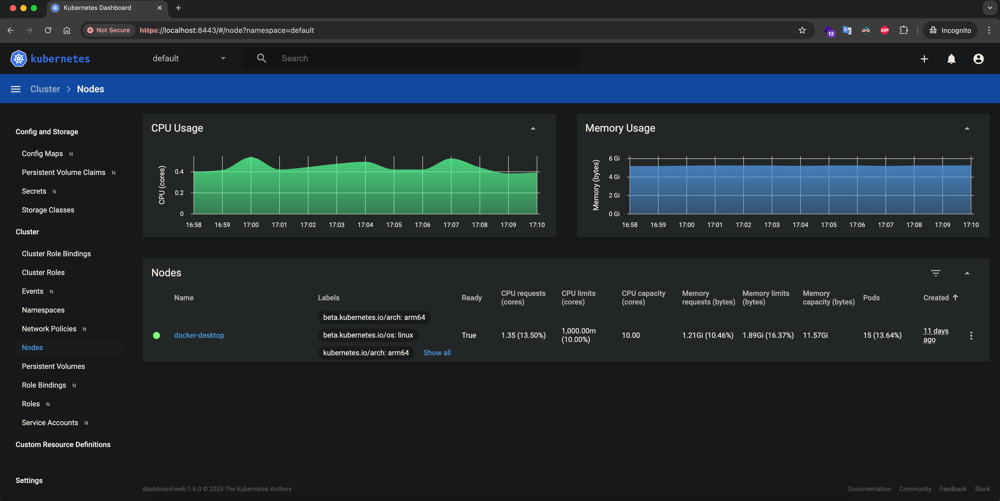
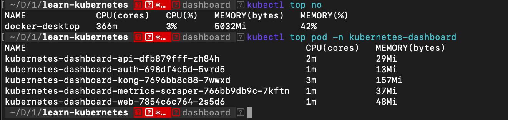

# Cài đặt và sử dụng Kubernetes Dashboard

## Kubernetes Dashboard là gì
Kubernetes Dashboard là một giao diện web giúp quản lý, giám sát và vận hành các ứng dụng cũng như tài nguyên trong cluster Kubernetes một cách trực quan.

Thông tin về dashboard có thể [xem tại đây](https://kubernetes.io/docs/tasks/access-application-cluster/web-ui-dashboard/) và [source code](https://github.com/kubernetes/dashboard)

## Cài đặt Dashboard trên hệ thống 3 node
```
# Download file dashboard-v270.yaml
curl https://raw.githubusercontent.com/kubernetes/dashboard/v2.7.0/aio/deploy/recommended.yaml > dashboard-v270.yaml
```
Thay đổi file cấu hình `dashboard-v270.yaml`
1. Đổi `type` sang `NodePort` và thêm `nodePort` là `31000`
```
  # Đổi kiểu sang NodePort
  type: NodePort

  ports:
    - port: 443
      targetPort: 8443
      # Chọn cổng truy cập qua Node là 31000
      nodePort: 31000
```
2. Xóa Secret có tên kubernetes-dashboard-certs
```
# ---

# apiVersion: v1
# kind: Secret
# metadata:
#   labels:
#     k8s-app: kubernetes-dashboard
#   name: kubernetes-dashboard-certs
#   namespace: kubernetes-dashboard
# type: Opaque
```
3. Triển khai `dashboard-v270.yaml`
```
kubectl apply -f dashboard-v270.yaml
```
4. Tạo kubernetes-dashboard-certs, xác thực SSL
```
mkdir -p certs
chmod -R 777 certs
openssl req -nodes -newkey rsa:2048 -keyout certs/dashboard.key -out certs/dashboard.csr -subj "/C=/ST=/L=/O=/OU=/CN=kubernetes-dashboard"
openssl x509 -req -sha256 -days 365 -in certs/dashboard.csr -signkey certs/dashboard.key -out certs/dashboard.crt
chmod -R 777 certs
```
5. Tạo secret
```
kubectl create secret generic kubernetes-dashboard-certs --from-file=certs -n kubernetes-dashboard
```

## Truy cập vào Dashboard
Dashboard will be available at: 
  https://172.16.11.100:31000/

Ở login page sẽ yêu cầu nhập token. 

### Lấy Token đăng nhập Dashboard

Hướng dẫn [xem tại đây](https://github.com/kubernetes/dashboard/blob/master/docs/user/access-control/creating-sample-user.md)

```
kubectl apply -f dashboard-adminuser.yaml
kubectl -n kubernetes-dashboard create token admin-user
```

## Cài đặt Dashboard trên Docker Desktop

```
# Add kubernetes-dashboard repository
helm repo add kubernetes-dashboard https://kubernetes.github.io/dashboard/
# Deploy a Helm Release named "kubernetes-dashboard" using the kubernetes-dashboard chart
helm upgrade --install kubernetes-dashboard kubernetes-dashboard/kubernetes-dashboard --create-namespace --namespace kubernetes-dashboard

# To access Dashboard run:
kubectl -n kubernetes-dashboard port-forward svc/kubernetes-dashboard-kong-proxy 8443:443
```

Dashboard will be available at: 
  https://localhost:8443/



## Triển khai Metric server

metrics server trong kubernetes ([metrics server](https://github.com/kubernetes-sigs/metrics-server)) giám sát về tài nguyên sử dụng trên cluster, cung cấp các API để các thành phần khác truy vấn đến biết được và mức độ sử dụng tài nguyên (CPU, Memory) của Pod, Node ... Cần có Metric Server để HPA hoạt động chính xác

```
kubectl apply -f metrics-server-deployment.yaml
```

Chờ 1 lúc để Metric server thu thập thông tin của các POD.
Khi có Metric server thì trong Dashboard có thêm thống kê về CPU, Memory của các POD, và có thêm lệnh xem tài nguyên về Node, Pod

```
kubectl top no
kubectl top pod
```
