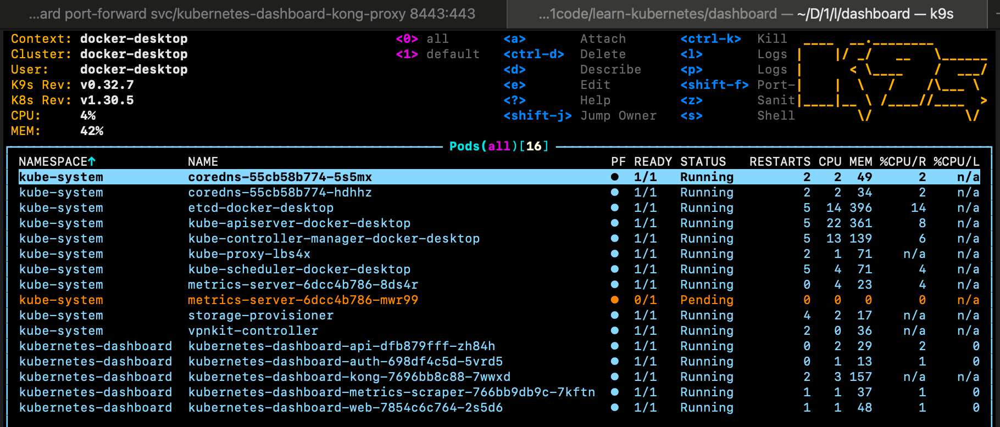

# Sử dụng k9s công cụ quản lý Kubernetes Cluster

## k9s tools
K9S là công cụ CLI để quản lý, tương tác với K8S (Kubernetes) với giao diện dòng lệnh trên Terminal, tuy nhiên vẫn rất trực quan.

Thông tin về k9s có thể [xem tại đây](https://github.com/derailed/k9s)

Cài đặt trên macOS
```
brew install derailed/k9s/k9s
```

Có thể xem tất cả các tài nguyên trong kubernetes bằng lệnh
```
kubectl api-resources
```



## Sử dụng watch command

Để xem tất cả các tài nguyên trên tất cả các namespace trong kubernetes, sử dụng `watch`

```
brew install watch
watch -n 1 kubectl get all,pv,pvc,ingress -o wide
```
