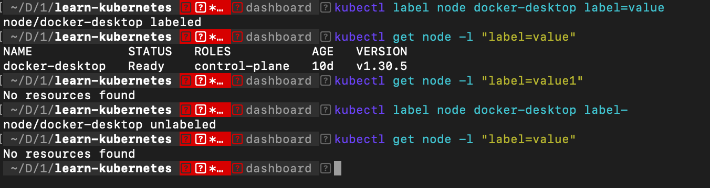
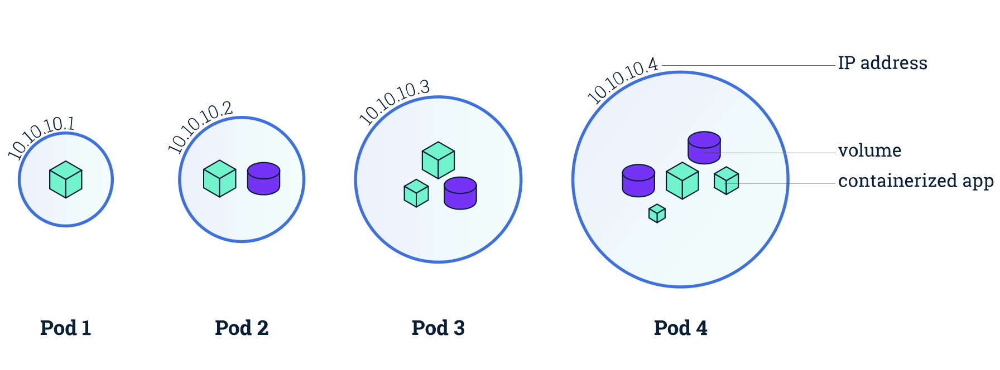

# Tìm hiểu về POD và Node trong Kubernetes

## Lệnh kubectl

Lệnh kubectl tương tác với Cluster, cú pháp chính
```
kubectl [command] [TYPE] [NAME] [flags]
```
Trong đó:

- [command] là lệnh, hành động như apply, create, get, describe, delete ...
- [TYPE] [kiểu tài nguyên](https://kubernetes.io/docs/reference/kubectl/#resource-types) như ns, no, po, svc ... 
- [NAME] tên đối tượng lệnh tác động
  + Để nhóm các tài nguyên cùng kiểu: TYPE1 name1 name2 name<#>
    Example: kubectl get pod example-pod1 example-pod2
  + Để gọi nhiều loại tài nguyên độc lập: TYPE1/name1 TYPE1/name2 TYPE2/name3 TYPE<#>/name<#>
    Example: kubectl get pod/example-pod1 replicationcontroller/example-rc1
- [flags] các thiết lập, tùy thuộc loại lệnh

## Node trong Kubernetes

### Node là gì?

Trong Kubernetes Node là đơn vị nhỏ nhất xét về phần cứng. Nó là một máy vật lý hay máy ảo (VPS) trong cụm máy (cluster). Xem các nút (node) trong cụm (cluster) chạy lệnh:

```
kubectl get nodes
```

### Label của Node

Thiết lập nhãn
```
kubectl label node docker-desktop label=value
```

Lấy các tài nguyên có nhãn nào đó
```
kubectl get node -l "label=value"
```
Xóa nhãn
```
kubectl label node docker-desktop label-
```



## Pods trong Kubernetes

### Pod là gì?

Kubernetes không chạy các container một cách trực tiếp, thay vào đó nó bọc một hoặc vài container vào với nhau trong một cấu trúc gọi là POD. Các container cùng một pod thì chia sẻ với nhau tài nguyên và mạng cục bộ của pod.



Pod là thành phần đơn vị (nhỏ nhất) để Kubernetes thực hiện việc nhân bản (replication), có nghĩa là khi cần thiết thì Kubernetes có thể cấu hình để triển khai nhân bản ra nhiều pod có chức năng giống nhau để tránh quá tải, thậm chí nó vẫn tạo ra nhiều bản copy của pod khi không quá tải nhằm phòng lỗi (ví dụ node bị die).

Pod có thể có nhiều container mà pod là đơn vị để scale (có nghĩa là tất cả các container trong pod cũng scale theo) nên nếu có thể thì cấu hình ứng dụng sao cho một Pod có ít container nhất càng tốt.

- Cách sử dụng hiệu quả và thông dụng là dùng loại Pod trong nó chỉ chạy một container.
- Pod chạy nhiều container trong đó thường là đóng gọi một ứng dụng xây dựng với sự phối hợp chặt chẽ từ nhiều container trong một khu vực cách ly, chúng chia sẻ tài nguyên ổ đĩa, mạng cho nhau.

### Mạng/Volume với Pod

Mỗi POD được gán một địa chỉ IP, các container trong Pod chia sẻ cùng địa chỉ IP này. Các container trong cùng một Pod có thể liên lạc với nhau qua localhost (Giống PHP truy cập đến MySQL khi hai thành phần này cài đặt trong một máy).

Một Pod có thể có nhiều ổ đĩa được chia sẻ để các container có thể truy cập đọc/ghi dữ liệu.

### Làm việc với Pod trong Kubernetes

Bạn có thể tạo ra Pod một cách trực tiếp (thực tế ít dùng) hoặc qua triển khai Deployment để Controller thực hiện, khi Pod được tạo ra nó được lên kế hoạch chạy trong một Node nào đó của cụm máy, nó tồn tại cho đến khi tiến trình chạy kết thúc hoặc bị xóa, bị lỗi Node ...

**Controller**: Khi bạn tạo các Pod không trực tiếp, tức thông qua cấu hình Deployment thì có một Controller thực hiện việc tạo quản lý các Pod cho bạn, thực hiện cách này nó cung cấp khả năng cập nhật giám sát, phục hồi ...

#### Liệt kê các Pod

```
# Liệt kê các pod ở namespace mặc định
kubectl get pods

# Hiện thị nhiều thông tin hơn
kubectl get pod -o wide

# Pod ở namepace: kubernetes-dashboard
kubectl get pod -o wide -n kubernetes-dashboard

# Pod ở tất cả các namespace
kubectl get pod -A

# Liệt kê các Pod có nhãn app: mypod
kubectl get pod -l "app=mypod"
```

#### Tạo Pod từ file cấu hình .yaml

Có thể tạo Pod từ lệnh `kubectl run` tuy nhiên nên khai báo Pod trong file config `.yaml` rồi chạy lệnh đọc file này và tạo pod với lệnh `kubectl apply`

Tham khảo chi tiết: [Pods](https://kubernetes.io/docs/concepts/workloads/pods/)

1-swarmtest-node.yaml
```
apiVersion: v1
kind: Pod
metadata:
  labels:
    app: app1
    ungdung: ungdung1
  name: ungdungnode
spec:
  containers:
  - name: c1
    image: ngovanhuy0241/k8s_container:node
    resources:
      limits:
        memory: "150M"
        cpu: "100m"
    env:
    - name: PORT
      value: "8085"
    ports:
      - containerPort: 8085
```

Triển khai Pod từ file này, thực hiện lệnh sau
```
kubectl apply -f 1-swarmtest-node.yaml
```

**Chú ý**
Mặc định Kubernetes không tạo và chạy POD ở node master để đảm bảo yêu cầu an toàn.
Nếu muốn chạy Pod ở Master thì chạy lệnh sau
```
kubectl taint node master node-role.kubernetes.io/control-plane-
```

Tương tự có thể triển khai 1 pod chứa container chạy nginx với file dưới

2-nginx.yaml
```
apiVersion: v1
kind: Pod
metadata:
  name: nginxapp
  labels:
    app: nginxapp
spec:
  containers:
  - name: n1
    image: nginx:1.17.6
    resources:
      limits:
        memory: "128Mi"
        cpu: "100m"
    ports:
      - containerPort: 80
```

Cũng khai báo 1 pod sử dụng image `ngovanhuy0241/tools` (1 image từ [Dockerfile](https://github.com/FinbertMDS/docker-testtools/blob/master/tools/Dockerfile) với Debian 11 có cài 1 số công cụ như vim, curl, wget ... để kiểm tra)

3-tools.yaml
```
apiVersion: v1
kind: Pod
metadata:
  name: tools
  labels:
    app: tools
spec:
  containers:
  - name: tools
    image: ngovanhuy0241/tools
    resources: {}
    command: ["/bin/bash"]
    args: ["-c", "while true; do echo 'tools running'; sleep 10;done"]
```

### Xem thông tin chi tiết của Pod

Sử dụng lệnh
```
kubectl describe pod/namepod
```
Nếu Pod đó trong một namepace khác mặc định cần chỉ ra namespace `-n namespace`

### Xem log của Pod

```
kubectl logs pod/podname
```

### Chạy 1 lệnh trong Pod

Thông tin chi tiết: [Get a Shell to a Running Container](https://kubernetes.io/docs/tasks/debug/debug-application/get-shell-running-container/)
```
kubectl exec podname -- command [arg]
```

Example: `kubectl exec -it mypod -- bash`

**Chú ý**
Nếu pod có nhiều container bên trong, thì cần chỉ rõ thi hành container nào bên trong nó bằng tham số `-c containername`

### Truy cập Pod từ bên ngoài cluster

Trong thông tin của Pod ta thấy có IP của Pod và cổng lắng nghe, tuy nhiên Ip này là nội bộ, chỉ các Pod trong Cluster liên lạc với nhau. Nếu bên ngoài muốn truy cập cần tạo một Service để chuyển traffic bên ngoài vào Pod (tìm hiểu sau), tại đây để debug - truy cập kiểm tra bằng cách chạy proxy

```
kubectl proxy
```

Truy cập đến địa chỉ `http://localhost:8001/api/v1/namespaces/default/pods/mypod:8085/proxy/`

Khi kiểm tra chạy thử, cũng có thể chuyển cổng để truy cập. Ví dụ cổng host `8080` được chuyển hướng truy cập đến cổng `8085` của POD `mypod`
```
kubectl port-forward mypod 8080:8085
```

**Cấu hình thăm dò Container còn sống**

Bạn có thể cấu hình `livenessProbe` cho mỗi container, để Kubernetes kiểm tra xem container còn sống không. Ví dụ, đường dẫn kiểm tra là `/healthycheck`, nếu nó trả về mã header trong khoảng `200` đến `400` được coi là sống (tất nhiên bạn cần viết ứng dụng trả về mã này). Trong đó cứ 10s kiểm tra một lần

```
apiVersion: v1
kind: Pod
metadata:
  name: mypod
  labels:
    app: mypod
spec:
  containers:
  - name: mycontainer
    image: ngovanhuy0241/k8s_container:php
    env:
    - name: PORT
      value: "8085"
    ports:
    - containerPort: 8085
    resources: {}

    livenessProbe:
      httpGet:
        path: /
        port: 8085
        httpHeaders:
        - name: live
          value: "còn sống"
      initialDelaySeconds: 10
      periodSeconds: 10
```

### Xoá Pod

Bạn có thể xóa Pod bằng lệnh
```
kubectl delete pod/mypod
```
Hoặc
```
kubectl delete -f firstpod.yaml
```
Do những Pod này chạy trực tiếp (không phải triển khai qua Deployment, nên lệnh xóa Pod là nó mất hẳn, không tự động tạo lại).

### Pod có nhiều container

Có thể chạy Pod mà bên trong chứa nhiều container, ví dụ file `4-nginx-swamtest.yaml`

4-nginx-swamtest.yaml
```
apiVersion: v1
kind: Pod
metadata:
  name: nginx-swarmtest
  labels:
    app: myapp
spec:
  containers:
  - name: n1
    image: nginx:1.17.6
    resources:
      limits:
        memory: "128Mi"
        cpu: "100m"
    ports:
      - containerPort: 80
  - name: s1
    image: ngovanhuy0241/k8s_container:node
    resources:
     limits:
       memory: "150Mi"
       cpu: "100m"
    ports:
      - containerPort: 8085
```

Trong đó chứa container n1 chạy từ image `nginx:1.17.6` và s1 chạy từ image `ngovanhuy0241/k8s_container:node`

### Volume trong Pod

Để thêm các Volume cần định nghĩa ở trường `spec.volumes`. Tại mỗi container gắn volume vào nếu cần với thuộc tính `volumeMounts`

5-nginx-swamtest-vol.yaml
```
apiVersion: v1
kind: Pod
metadata:
  name: nginx-swarmtest-vol
  labels:
    app: myapp
spec:
  nodeSelector:
    kubernetes.io/hostname: worker1
  volumes:
    # Định nghĩa một volume - ánh xạ thư mục /home/www máy host
    - name: "myvol"
      hostPath:
          path: "/home/html"
  containers:
  - name: n1
    image: nginx:1.17.6
    resources:
      limits:
        memory: "128Mi"
        cpu: "100m"
    ports:
      - containerPort: 80
    volumeMounts:
      - mountPath: /usr/share/nginx/html
        name: "myvol"
  - name: s1
    image: ngovanhuy0241/k8s_container:node
    resources:
     limits:
       memory: "150Mi"
       cpu: "100m"
    ports:
      - containerPort: 8085
    volumeMounts:
      - mountPath: /data/
        name: "myvol"
```

Nếu muốn sử dụng ổ đĩa - giống nhau về dữ liệu trên nhiều POD, kể cả các POD đó chạy trên các máy khác nhau thì cần dùng các loại đĩa Remote - ví dụ NFS - loại đĩa này nói ở các phần sau.

## Cleanup

```
kubectl delete -f .
```

## Sumup

Cách lệnh làm việc với label:
```
# Thiết lập nhãn
kubectl label node docker-desktop label=value

# Lấy các tài nguyên có nhãn nào đó
kubectl get node -l "label=value"

# Xóa nhãn
kubectl label node docker-desktop label-
```

Cách lệnh làm việc với Pod:
| Lệnh                                 | Diễn giải                                                                                                                                                                                  |
| ------------------------------------ | ------------------------------------------------------------------------------------------------------------------------------------------------------------------------------------------ |
| kubectl get nodes                    | Danh sách các Node trong Cluster                                                                                                                                                           |
| kubectl describe node name-node      | Thông tin chi tiết về Node có tên name-node                                                                                                                                                |
| kubectl get pods                     | Liệt kê các POD trong namespace hiện tại, thêm tham số -o wide hiện thị chi tiết hơn, thêm -A hiện thị tất cả namespace, thêm -n namespacename hiện thị Pod của namespace namespacename    |
| kubectl explain pod --recursive=true | Xem cấu trúc mẫu định nghĩa POD trong file cấu hình yaml                                                                                                                                   |
| kubectl apply -f firstpod.yaml       | Triển khai tạo các tài nguyên định nghĩa trong file firstpod.yaml                                                                                                                          |
| kubectl delete -f firstpod.yaml      | Xóa các tài nguyên tạo ra từ định nghĩa firstpod.yaml                                                                                                                                      |
| kubectl describe pod/namepod         | Lấy thông tin chi tiết POD có tên namepod, nếu POD trong namespace khác mặc định thêm vào tham số -n namespace-name                                                                        |
| kubectl logs pod/podname             | Xem logs của POD có tên podname                                                                                                                                                            |
| kubectl exec mypod command           | Chạy lệnh từ container của POD có tên mypod, nếu POD có nhiều container thêm vào tham số -c và tên container                                                                               |
| kubectl exec -it mypod -- bash       | Chạy lệnh bash của container trong POD mypod và gắn terminal                                                                                                                               |
| kubectl proxy                        | Tạo server proxy truy cập đến các tài nguyên của Cluster. http://localhost:8001/api/v1/namespaces/default/pods/mypod/proxy/, truy cập đến container có tên mypod trong namespace mặc định. |
| kubectl delete pod/mypod             | Xóa POD có tên mypod                                                                                                                                                                       |