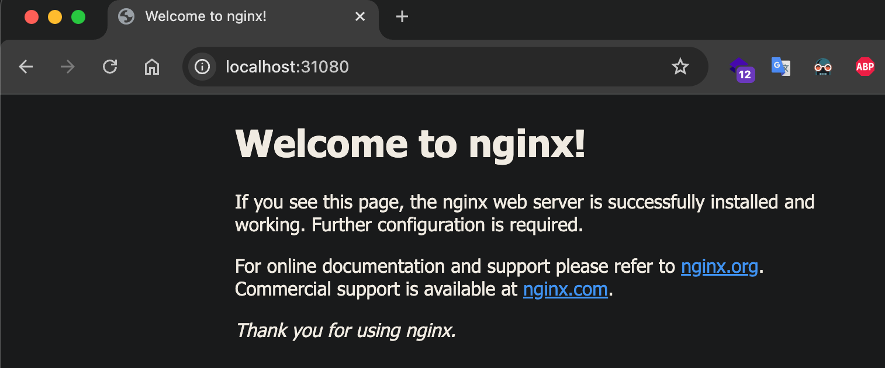

# Sử dụng Service và Secret Tls

## Service


Các POD được quản lý trong Kubernetes, trong vòng đời của nó chỉ diễn ra theo hướng - được tạo ra, chạy và khi nó kết thúc thì bị xóa và khởi tạo POD mới thay thế. ! Có nghĩa ta không thể có tạm dừng POD, chạy lại POD đang dừng ...

Mặc dù mỗi POD khi tạo ra nó có một IP để liên lạc, tuy nhiên vấn đề là mỗi khi POD thay thế thì là một IP khác, nên các dịch vụ truy cập không biết IP mới nếu ta cấu hình nó truy cập đến POD nào đó cố định. Để giải quyết vấn đề này sẽ cần đến Service.

Service (micro-service) là một đối tượng trừu tượng nó xác định ra một nhóm các POD và chính sách để truy cập đến POD đó. Nhóm cá POD mà Service xác định thường dùng kỹ thuật `Selector` (chọn các POD thuộc về Service theo `label` của POD).

Cũng có thể hiểu Service là một dịch vụ mạng, tạo cơ chế cân bằng tải (load balancing) truy cập đến các điểm cuối (thường là các Pod) mà Service đó phục vụ.

## Tạo Service

Tham khảo [Service](https://kubernetes.io/docs/concepts/services-networking/service/)

### Tạo Service kiểu ClusterIP, không Selector

1.svc1.yaml
```
apiVersion: v1
kind: Service
metadata:
  name: svc1
spec:
  type: ClusterIP
  ports:
  - port: 80
    targetPort: 80
```

File trên khai báo một service đặt tên `svc1`, kiểu của service là `ClusterIP`, đây là kiểu mặc định (ngoài ra còn có kiểu `NodePort`, `LoadBalancer`, `ExternalName`), phần khai báo cổng gồm có cổng của service (port) tương ứng ánh xạ vào cổng của endpoint (targetPort - thường là cổng Pod).

Triển khai file trên
```
kubectl apply -f 1.svc1.yaml

# lấy các service
kubectl get svc -o wide

# xem thông tin của service svc1
kubectl describe svc/svc1
```

### Tạo EndPoint cho Service (không selector)

Service trên có tên `svc1`, không có `selector` để xác định các Pod là endpoint của nó, nên ta có thể tự tạo ra một endpoint cùng tên `svc1`

2.endpoint.yaml
```
apiVersion: v1
kind: Endpoints
metadata:
  name: svc1
subsets:
  - addresses:
      - ip: 142.250.196.131      # đây là IP google
    ports:
      - port: 80
```
Triển khai với lệnh
```
kubectl apply -f 2.endpoint.yaml
```

Như vậy `svc1` đã có `endpoints`, khi truy cập `svc1:80` hoặc `svc1.default:80` hoặc `10.106.140.131:80` có nghĩa là truy cập `142.250.196.131:80`

> Do có dịch vụ CoreDns nên có thể truy cập thông qua phân giải tên, truy cập đến service theo cấu trúc `namespace.servicename` nếu cùng namespace chỉ cần `servicenname`


> Ví dụ trên sử dụng Service (không có Selector), cần tạo Endpoint có tên cùng tên Service: dùng loại này khi cần tạo ra một điểm truy cập dịch vụ tương tự như proxy đến một địa chỉ khác (một server khác, một dịch vụ khác ở namespace khác ...)


**Chú ý**
Nếu tạo Endpoint có tên cùng tên Service đã có selector thì Endpoint mới đó không hoạt động, vẫn giữ Endpoint cũ tới các selector


### Tạo Service có Selector, chọn các Pod là Endpoint của Service

Trước tiên triển khai trên Cluster 2 POD chạy độc lập, các POD đó đều có nhãn `app: app1`

3.pods.yaml
```
apiVersion: v1
kind: Pod
metadata:
  name: myapp1
  labels:
    app: app1
spec:
  containers:
  - name: n1
    image: nginx
    resources:
      limits:
        memory: "128Mi"
        cpu: "100m"
    ports:
      - containerPort: 80
---
apiVersion: v1
kind: Pod
metadata:
  name: myapp2
  labels:
    app: app1
spec:
  containers:
  - name: n1
    image: httpd
    resources:
      limits:
        memory: "128Mi"
        cpu: "100m"
    ports:
      - containerPort: 80
```
Triển khai file trên
```
kubectl apply -f 3.pods.yaml
```


Nó tạo ra 2 POD myapp1 (10.1.0.50 chạy nginx) và myapp2 (10.1.0.51 chạy httpd), chúng đều có nhãn app=app1

Tiếp tục tạo ra service có tên `svc2` có thêm thiết lập selector chọn nhãn `app=app1`

4.svc2.yaml
```
apiVersion: v1
kind: Service
metadata:
  name: svc2
spec:
  selector:
     app: app1

  type: ClusterIP

  ports:
    - port: 80
      targetPort: 80
```

Triển khai và kiểm tra


Thông tin trên ta có, endpoint của `svc2` là `10.1.0.50:80`,`10.1.0.51:80`, hai IP này tương ứng là của 2 POD trên. Khi truy cập địa chỉ `svc2:80` hoặc `10.97.179.79:80` thì căn bằng tải hoạt động sẽ là truy cập đến `10.1.0.50:80` (myapp1) hoặc `10.1.0.51:80` (myapp2)

### Tạo Service kiểu NodePort

Kiểu NodePort này tạo ra có thể truy cập từ ngoài internet bằng IP của các Node, ví dụ sửa dịch vụ `svc2` trên thành dịch vụ `svc3` kiểu NodePort

5.svc3.yaml
```
apiVersion: v1
kind: Service
metadata:
  name: svc3
spec:
  type: NodePort
  selector:
    app: app1
  ports:
  - port: 80
    targetPort: 80
    nodePort: 31080
```

Trong file trên, thiết lập kiểu với `type: NodePort`, lúc này Service tạo ra có thể truy cập từ các IP của Node với một cổng nó ngẫu nhiên sinh ra trong khoảng [`30000-32767`](https://kubernetes.io/docs/concepts/services-networking/service/#type-nodeport). Nếu muốn ấn định một cổng của Service mà không để ngẫu nhiên thì dùng tham số nodePort như trên.

Triển khai file trên
```
kubectl appy -f 5.svc3.yaml
```

Sau khi triển khai có thể truy cập với IP là địa chỉ IP của các Node và cổng là `31080`, ví dụ `172.16.11.101:31080`


## Ví dụ ứng dụng Service, Deployment, Secret

Trong ví dụ này, sẽ thực hành triển khai chạy máy chủ nginx với mức độ áp dụng phức tạp hơn đó là:

- Xây dựng một image mới từ image cơ sở nginx rồi đưa lên registry Hub Docker đặt tên là `ngovanhuy0241/k8s_container:nginx`
- Tạo Secret chứa xác thực SSL sử dụng bởi `ngovanhuy0241/k8s_container:nginx`
- Tạo deployment chạy/quản lý các POD có chạy `ngovanhuy0241/k8s_container:nginx`
- Tạo Service kiểu NodePort để truy cập đến các POD trên

### Xây dựng image từ nginx có dùng SSL

Image cơ sở là [nginx](https://hub.docker.com/_/nginx) (chọn tag bản 1.17.6), đây là một proxy nhận các yêu cầu gửi đến. Ta sẽ cấu hình để nó nhận các yêu cầu http (cổng 80) và https (cổng 443).

Tạo ra thư mục `nginx` để chứa các file dữ liệu, đầu tiên là tạo ra file cấu hình `nginx.conf`, file cấu hình này được copy vào image ở đường dẫn `/etc/nginx/nginx.conf` khi build image.

1. Chuẩn bị file cấu hình nginx.conf

nginx.conf
```
error_log  /var/log/nginx/error.log warn;
pid        /var/run/nginx.pid;

events {
  worker_connections  4096;  ## Default: 1024
}


http {
    include       /etc/nginx/mime.types;
    default_type  application/octet-stream;

    log_format  main  '$remote_addr - $remote_user [$time_local] "$request" '
                      '$status $body_bytes_sent "$http_referer" '
                      '"$http_user_agent" "$http_x_forwarded_for"';

    access_log  /var/log/nginx/access.log  main;

    sendfile        on;
    keepalive_timeout  65;
    #gzip  on;
    server {
        listen 80;
        server_name localhost;                    # my-site.com
        root  /usr/share/nginx/html;
    }
    server {
        listen  443 ssl;
        server_name  localhost;                   # my-site.com;
        ssl_certificate /certs/tls.crt;           # fullchain.pem
        ssl_certificate_key /certs/tls.key;       # privkey.pem
        root /usr/share/nginx/html;
    }
}
```

Để ý file cấu hình này, thiết lập nginx lắng nghe yêu cầu gửi đến cổng 80 và 443 (tương ứng với 2 server), thư mục gốc làm việc mặc định của chúng là `/usr/share/nginx/html`, tại đây sẽ copy và một file `index.html`

2. Chuẩn bị file index.html

index.html
```
<!DOCTYPE html>
<html>
<head><title>Nginx -  Test!</title></head>
<body>
    <h1>Chạy Nginx trên Kubernetes</h1>    
</body>
</html>
```

3. Build image

Tạo `Dockerfile` xây dựng Image mới, từ image cơ sở `nginx:1.17.6`, có copy 2 file `nginx.conf` và `index.html` vào image mới này

Dockerfile
```
FROM nginx:1.17.6
COPY nginx.conf /etc/nginx/nginx.conf
COPY index.html /usr/share/nginx/html/index.html
```

Build thành Image mới đặt tên là ngovanhuy0241/k8s_container:nginx (đặt tên theo tài khoản của bạn trên Hub Docker, hoặc theo cấu trúc Registry riêng nếu sử dụng) và push Image nên Docker Hub

```
# build image từ Dockerfile, đặt tên image mới là ngovanhuy0241/k8s_container:nginx
docker build -t ngovanhuy0241/k8s_container:nginx -f Dockerfile .

# đẩy image lên hub docker
docker push ngovanhuy0241/k8s_container:nginx
```

Có thể dùng [bash script này](exams/4.svc/nginx/builimg.sh)

### Tạo Deployment triển khai các Pod chạy ngovanhuy0241/k8s_container:nginx

6.nginx.yaml
```
apiVersion: apps/v1
kind: Deployment
metadata:
  name: nginx
spec:
  replicas: 1
  selector:
    matchLabels:
      app: nginx
  template:
    metadata:
      labels:
        app: nginx
    spec:
      containers:
      - name: n1
        image: ngovanhuy0241/k8s_container:nginx
        resources:
          limits:
            memory: "128Mi"
            cpu: "100m"
        ports:
        - containerPort: 80
        - containerPort: 443
```

Khi triển khai file này, có lỗi tạo container vì trong cấu hình có thiết lập SSL (server lắng nghe cổng 443) với các file xác thực ở đường dẫn `/certs/tls.crt`, `/certs/tls.key` nhưng hiện tại file này không có, ta sẽ sinh hai file này và đưa vào qua Secret

### Tự sinh xác thực với openssl

Xác thực SSL gồm có server certificate và private key, đối với nginx cấu hình qua hai thiết lập ssl_certificate và ssl_certificate_key tương ứng ta đã cấu hình là hai file tls.crt, tls.key. Ta để tên này vì theo cách đặt tên của letsencrypt.org, sau này bạn có thể thận tiện hơn nếu xin xác thực miễn phí từ đây.

Thực hiện lệnh sau để sinh file tự xác thực

```
openssl req -nodes -newkey rsa:2048 -keyout certs/tls.key -out certs/ca.csr -subj "/CN=finbertmds.test"
openssl x509 -req -sha256 -days 365 -in certs/ca.csr -signkey certs/tls.key -out certs/tls.crt
```

Đến đây có 2 file `tls.key` và `tls.crt`

### Tạo Secret tên secret-nginx-cert chứa các xác thực

Thi hành lệnh sau để tạo ra một Secret (loại ổ đĩa chứa các thông tin nhạy cảm, nhỏ), Secret này kiểu tls, tức chứa xác thức SSL

```
kubectl create secret tls secret-nginx-cert --cert=certs/tls.crt  --key=certs/tls.key
```

Secret này tạo ra thì mặc định nó đặt tên file là tls.crt và tls.key có thể xem với lệnh

```
kubectl describe secret/secret-nginx-cert
```


### Sử dụng Secret cho Pod

Đã có Secret, để POD sử dụng được sẽ cấu hình nó như một ổ đĩa đê Pod đọc, sửa lại Deployment `6.nginx.yaml` như sau:

6.nginx.yaml
```
apiVersion: apps/v1
kind: Deployment
metadata:
  name: nginx
spec:
  replicas: 3
  selector:
    matchLabels:
      app: nginx
  template:
    metadata:
      labels:
        app: nginx
    spec:
      volumes:
        - name: cert-volume
          secret:
              secretName: "secret-nginx-cert"
      containers:
      - name: n1
        image: ngovanhuy0241/k8s_container:nginx
        resources:
          limits:
            memory: "128Mi"
            cpu: "100m"
        ports:
        - containerPort: 80
        - containerPort: 443
        volumeMounts:
          - name: cert-volume
            mountPath: "/certs/"
```

### Tạo Service truy cập kiểu NodePort

Thêm vào cuối file `6.nginx.yaml`

6.nginx.yaml
```
---
apiVersion: v1
kind: Service
metadata:
  name: my-nginx
spec:
  type: NodePort
  ports:
  - port: 8080        # cổng dịch vụ ánh xạ vào cổng POD
    targetPort: 80    # cổng POD ánh xạ vào container
    protocol: TCP
    name: http
    nodePort: 31080   # cổng NODE ánh xạ vào cổng dịch vụ (chỉ chọn 30000-32767)

  - port: 443
    targetPort: 443
    protocol: TCP
    name: https
    nodePort: 31443
  # Chú ý đúng với Label của POD tại Deployment
  selector:
    app: nginx     
```

Giờ có thể truy cập từ địa chỉ IP của Node với cổng tương ứng (Kubernetes Docker thì http://localhost:31080 và https://localhost:31443)




## Cleanup

```
kubectl delete -f .
```
