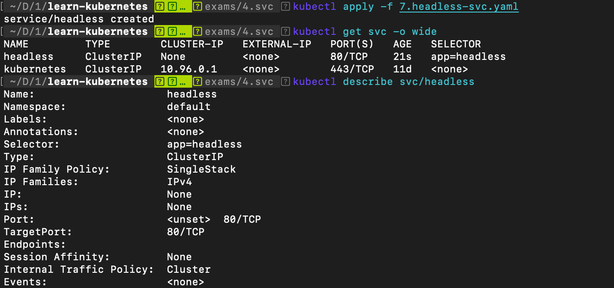
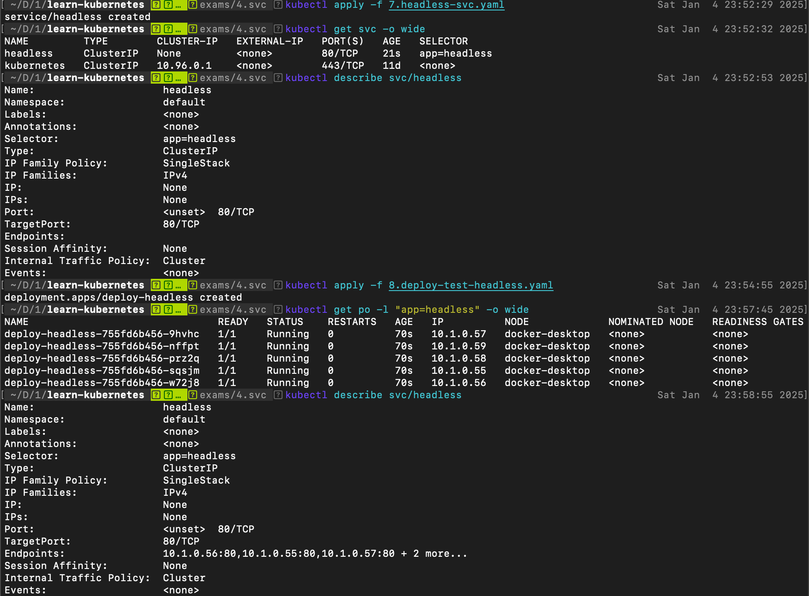
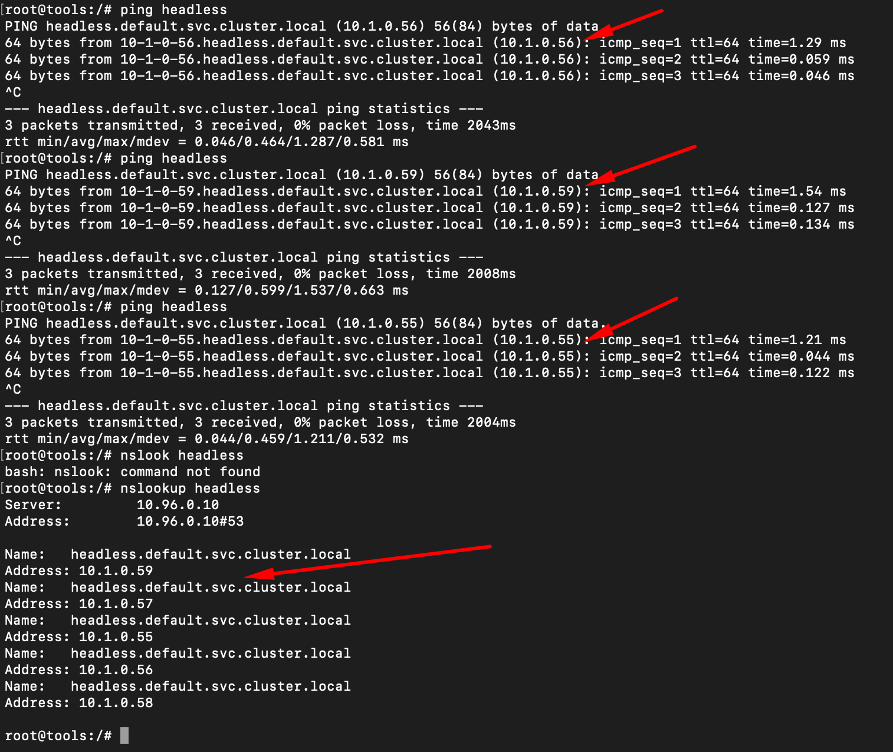

# Thực hành tạo Headless Service 

Tạo Service kiểu headless, truy vấn thẳng đến các IP của các Pod trong Kubernetes

## Tìm hiểu Headless Service

Các `Service` trước bạn tạo nó có một địa chỉ IP riêng của Service, nó dùng cơ chế cân bằng tải để liên kết với các POD. Tuy nhiên nếu nuốn không dùng cơ chế cân bằng tải, mỗi lần truy cập tên Service nó truy cập thẳng tới IP của PO thì dùng loại `Headless Service`.

Một `Headless Service` (Service không IP) nó liên kết thẳng với IP của POD, có nghĩa bạn sẽ không tương tác trực tiếp với POD qua proxy. Tạo loại Service này giống như Service khác, chỉ việc thiết lập thêm `.spec.clusterIP` có giá trị `None`

## Tạo Headless Service

7.headless-svc.yaml
```
apiVersion: v1
kind: Service
metadata:
  name: headless       # đặt tên Service
spec:
  clusterIP: None      # Thiết lập là Headless Svc
  selector:
    app: headless      # Các nhãn của POD nó quản lý
  ports:
    - protocol: TCP
      port: 80         # Cổng Service
      targetPort: 80   # Cổng POD (container, endpoints)
```

```
# triển khai service
kubectl apply -f 7.headless-svc.yaml

# ds service
kubectl get svc -o wide
```

Như vậy vừa tạo một Headless Svc tên `headless`, bạn thấy nó có CLUSTER-IP là None, và nó bao bọc các Pod với nhãn là `app=headless`, hiện giờ chưa triển khai POD nào có nhãn như vậy nên khi kiểm tra chi tiết Service thấy như sau:



Thấy mục Endpoint là None (không có POD nào)

Giờ triển khai một Deploy tạo POD có nhãn trên

8.deploy-test-headless.yaml
```
apiVersion: v1
kind: Service
metadata:
  name: headless       # đặt tên Service
spec:
  clusterIP: None      # Thiết lập là Headless Svc
  selector:
    app: headless      # Các nhãn của POD nó quản lý
  ports:
    - protocol: TCP
      port: 80         # Cổng Service
      targetPort: 80   # Cổng POD (container, endpoints)
```

Sau khi triển khai manifest trên với lệnh
```
kubectl apply -f 8.deploy-test-headless.yaml
```
Kiểm tra lại service headless thấy Endpoint tương ứng với các IP của POD:



Bạn có thể vào một Container trong hệ thống Kubernetes, thực hiện lệnh `ping` đến Service headless (một lần trả về IP của POD chứ không có IP service như trước), hoặc dùng lệnh `nslookup` để phân giải tên `headless` là những IP nào.



## Cleanup

```
kubectl delete -f .
```
