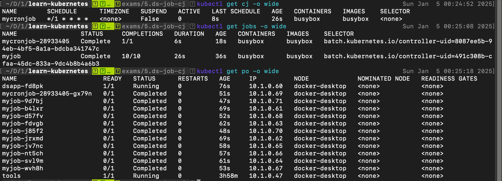

# DaemonSet, Job và CronJob

## DaemonSet

DaemonSet (`ds`) đảm bảo chạy trên mỗi NODE một bản copy của POD. Triển khai DaemonSet khi cần ở mỗi máy (Node) một POD, thường dùng cho các ứng dụng như thu thập log, tạo ổ đĩa trên mỗi Node ... Dưới đây là ví dụ về DaemonSet, nó tạo tại mỗi Node một POD chạy nginx

Tham khảo [DaemonSet](https://kubernetes.io/docs/concepts/workloads/controllers/daemonset/)

1.ds.yaml
```
apiVersion: apps/v1
kind: DaemonSet
metadata:
  name: dsapp
spec:

  selector:
    matchLabels:
      app: ds-nginx

  template:
    metadata:
      labels:
        app: ds-nginx
    spec:
      containers:
      - name: nginx
        image: nginx
        resources:
          limits:
            memory: "128Mi"
            cpu: "100m"
        ports:
        - containerPort: 80
```

Triển khai
```
kubectl apply -f 1.ds.yaml
```

```
# Liệt kê các DaemonSet
kubectl get ds -o wide

# Liệt kê các POD theo nhãn
kubectl get pod -o wide -l "app=ds-nginx"

# Chi tiết về ds
kubectl describe ds/dsapp

# Xóa DaemonSet
kubectl delete ds/dsapp
```

> Mặc định NODE master của kubernetes không cho triển khai chạy các POD trên nó để an toàn, nếu muốn cho phép tạo Pod trên node Master thì xóa đi `taint` có tên `node-role.kubernetes.io/control-plane`

Tham khảo [labels-annotations-taints](https://kubernetes.io/docs/reference/labels-annotations-taints/#node-role-kubernetes-io-control-plane)

```
# xóa taint trên node master cho phép tạo Pod
kubectl taint node master node-role.kubernetes.io/control-plane-

# thêm taint trên node master ngăn tạo Pod trên nó
kubectl taint nodes master node-role.kubernetes.io/control-plane:NoSchedule
```

## Job

Job (`jobs`) có chức năng tạo các POD đảm bảo nó chạy và kết thúc thành công. Khi các POD do Job tạo ra chạy và kết thúc thành công thì Job đó hoàn thành. Khi bạn xóa Job thì các Pod nó tạo cũng xóa theo. Một Job có thể tạo các Pod chạy tuần tự hoặc song song. Sử dụng Job khi muốn thi hành một vài chức năng hoàn thành xong thì dừng lại (ví dụ backup, kiểm tra ...)

Tham khảo [Api Job](https://kubernetes.io/docs/concepts/workloads/controllers/job/)

2.job.yaml
```
apiVersion: batch/v1
kind: Job
metadata:
  name: myjob
spec:
  # Số lần chạy POD thành công
  completions: 10
  # Số lần tạo chạy lại POD bị lỗi, trước khi đánh dấu job thất bại
  backoffLimit: 3
  # Số POD chạy song song
  parallelism: 2
  # Số giây tối đa của JOB, quá thời hạn trên hệ thống ngắt JOB
  activeDeadlineSeconds: 120

  template:
    spec:
      containers:
      - name: busybox
        image: busybox
        command:
          - /bin/sh
          - -c
          - date; echo "Job executed"
      restartPolicy: Never
```

```
# Triển khai 1 job
kubectl apply -f 2.job.yaml

# Thông tin job có tên myjob
kubectl describe job/myjob
```

## CronJob

CronJob (`cj`) - chạy các Job theo một lịch định sẵn. Việc lên lịch cho CronJob khai báo giống Cron của Linux. 
[crontab.guru](https://crontab.guru/)
Xem [Sử dụng Cron, Crontab từ động chạy script trên Server Linux](https://xuanthulab.net/su-dung-cron-crontab-tu-dong-chay-script-tren-server-linux.html)

Tham khảo [Api CronJob](https://kubernetes.io/docs/concepts/workloads/controllers/cron-jobs/)

3.cronjob.yaml
```
apiVersion: batch/v1
kind: CronJob
metadata:
  name: mycronjob
spec:

  # Một phút chạy một Job
  schedule: "*/1 * * * *"

  # Số Job lưu lại
  successfulJobsHistoryLimit: 3

  jobTemplate:
    spec:
      template:
        spec:
          containers:
          - name: busybox
            image: busybox
            args:
            - /bin/sh
            - -c
            - date; echo "Job in CronJob"
          restartPolicy: Never
```

```
# Danh sách các CronJob
kubectl get cj -o wide

# Danh sách các Job
kubectl get jobs -o wide
```



## Cleanup

```
kubectl delete -f .
```
