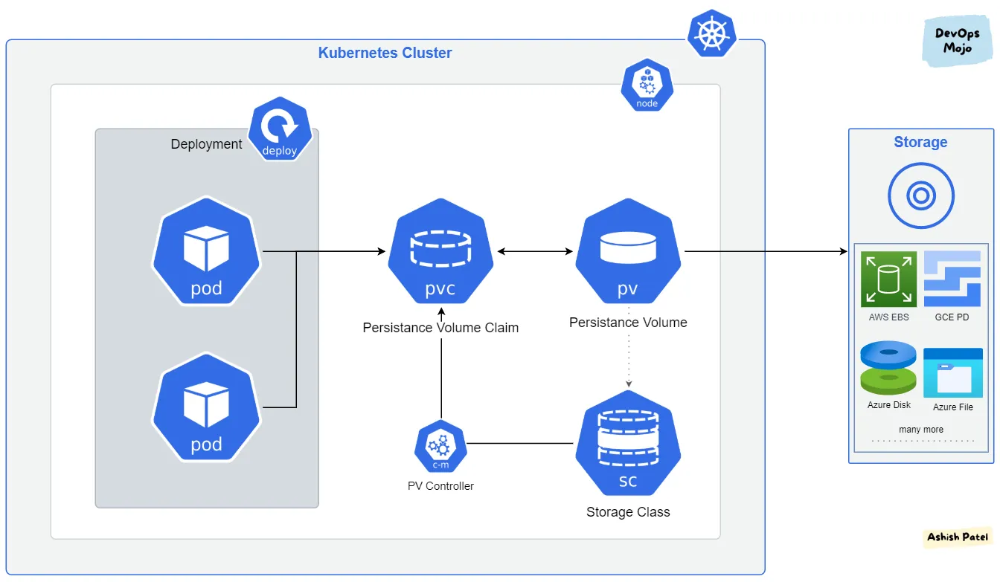
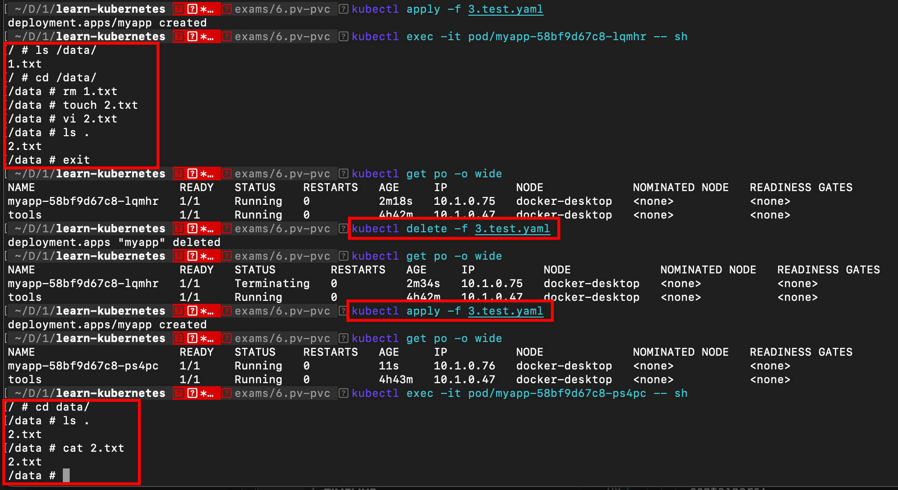

# Sử dụng Persistent Volume (pv) và Persistent Volume Claim (pvc)

Tạo ổ đĩa lưu dữ liệu lâu dài PV và yêu cầu truy cập đến PV bằng PVC, cách mount PVC vào POD

## Persistent Volume



PersistentVolume (pv) là một phần không gian lưu trữ dữ liệu trong cluster, các PersistentVolume giống với Volume bình thường tuy nhiên nó tồn tại độc lập với POD (pod bị xóa PV vẫn tồn tại), có nhiều loại PersistentVolume có thể triển khai như NFS, Clusterfs ... (xem tại Các kiểu [PersistentVolume](https://kubernetes.io/docs/concepts/storage/persistent-volumes/) )

PersistentVolumeClaim (`pvc`) là yêu cầu sử dụng không gian lưu trữ (sử dụng PV).


## Tạo Persistent Volume

Ví dụ này, sẽ tạo PV loại hostPath, tức ánh xạ một thư mục trên máy chạy POD. Tạo một manifest như sau:

1.persistent-vol.yaml
```
apiVersion: v1
kind: PersistentVolume
metadata:
  name: pv1
spec:
  storageClassName: mystorageclass
  capacity:
    storage: 5Gi
  accessModes:
    - ReadWriteOnce
  hostPath:
    path: "/v1"
```

```
# triển khai
kubectl apply -f 1.persistent-vol.yaml

# liệt kê các PV
kubectl get pv -o wide

# thông tin chi tiết
kubectl describe pv/pv1
```


## Tạo Persistent Volume Claim

PVC (Persistent Volume Claim) là yêu cầu truy cập đến PV, một PV chỉ có một PVC

2.persistent-vol-claim.yaml
```
apiVersion: v1
kind: PersistentVolumeClaim
metadata:
  name: pvc1
spec:
  storageClassName: mystorageclass
  accessModes:
    - ReadWriteOnce
  resources:
    requests:
      storage: 150Mi
```

```
# triển khai
kubectl apply -f 2.persistent-vol-claim.yaml

kubectl get pvc,pv -o wide
kubectl describe pvc/pvc1
```


## Sử dụng PVC vào POD (Container)

3.test.yaml
```
apiVersion: apps/v1
kind: Deployment
metadata:
  name: myapp
spec:
  replicas: 1
  selector:
    matchLabels:
      app: myapp
  template:
    metadata:
      labels:
        app: myapp
    spec:
      volumes:
        - name: myvolume
          persistentVolumeClaim:
              claimName: pvc1
      containers:
      - name: myapp
        image: busybox
        resources: {}
        command:
          - sleep
          - "600"
        volumeMounts:
          - mountPath: "/data"
            name: myvolume
```



Sau khi xoá pod `myapp` thì data trong `pvc` vẫn còn.
Tạo lại pod `myapp`, các file lưu trong `pvc` được mount lại vào pod.

## Cleanup

```
kubectl delete -f .
```
