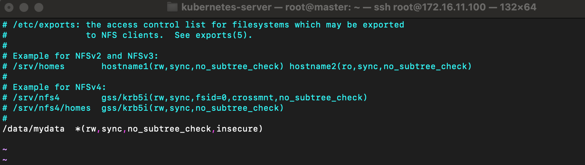
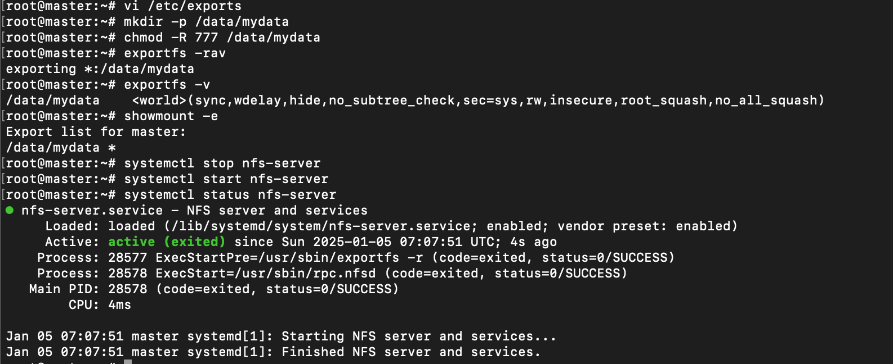
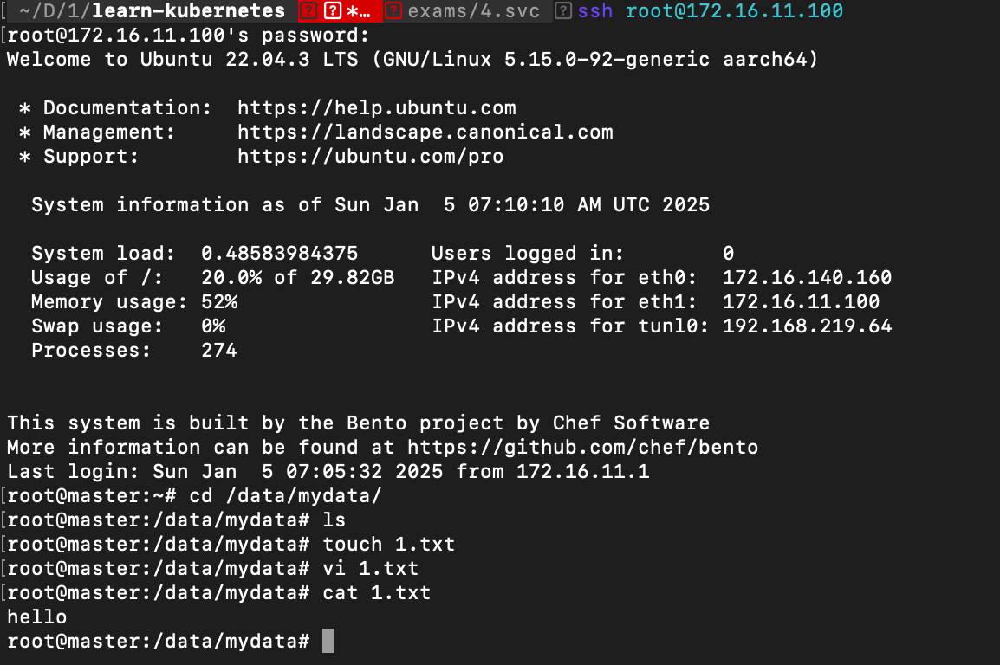
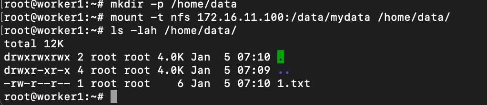
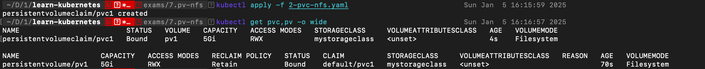
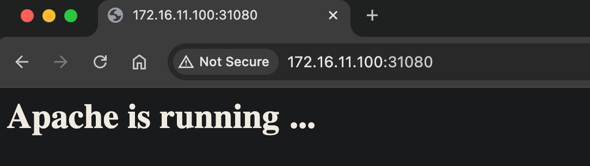

# Sử dụng PersistentVolume NFS

## Cài đặt NFS làm Server chia sẻ file

### Cài đặt node master
```
apt -y install nfs-kernel-server
```

Tạo (mở) file /etc/exports để soạn thảo, ở đây sẽ cấu hình để chia sẻ thư mục /data/mydata/
```
vi /etc/exports
```
```
/data/mydata  *(rw,sync,no_subtree_check,insecure)
```

Lưu lại thông tin, và thực hiện các lệnh dưới
```
# Tạo thư mục
mkdir -p /data/mydata
chmod -R 777 /data/mydata

# export và kiểm tra cấu hình chia sẻ
exportfs -rav
exportfs -v
showmount -e

# Khởi động lại và kiểm tra dịch vụ
systemctl stop nfs-server
systemctl start nfs-server
systemctl status nfs-server
```

Như vậy, node `master` có địa chỉ IP `172.16.11.100` đã có Server chia sẻ file NFS, đường dẫn chia sẻ file `/data/mydata`.



Trong foler `/data/mydata` tạo 1 file sample `1.txt` để test chia sẻ file NFS


### Cài đặt node worker1, worker2

Giờ vào máy node `worker1` và `worker2` thực hiện mount ổ đĩa xem có hoạt động không.
```
apt -y install nfs-kernel-server
mkdir -p /home/data

# Gắn ổ đĩa
mount -t nfs 172.16.11.100:/data/mydata /home/data/

# Kiểm tra xong, hủy gắn ổ đĩa
umount /home/data
```



## Tạo PersistentVolume NFS

1-pv-nfs.yaml
```
apiVersion: v1
kind: PersistentVolume
metadata:
  name: pv1
spec:
  storageClassName: mystorageclass
  capacity:
    storage: 5Gi
  accessModes:
    - ReadWriteMany
  nfs:
    path: "/data/mydata/"
    server: "172.16.11.100"
```
Triển khai và kiểm tra
```
kubectl apply -f 1-pv-nfs.yaml
kubectl get pv -o wide
kubectl describe pv/pv1
```


## Tạo PersistentVolumeClaim NFS

2-pvc-nfs.yaml
```
apiVersion: v1
kind: PersistentVolumeClaim
metadata:
  name: pvc1
spec:
  storageClassName: mystorageclass
  accessModes:
    - ReadWriteMany
  resources:
    requests:
      storage: 5Gi
```
Triển khai và kiểm tra
```
kubectl apply -f 2-pvc-nfs.yaml
kubectl get pvc,pv -o wide
```



## Mount PersistentVolumeClaim NFS vào Container

Ta sẽ triển khai chạy máy chủ web từ image `httpd`.

SSH vào máy `master`, vào thư mục chia sẻ `/data/mydata` tạo một file `index.html` với nội dung đơn giản, ví dụ:
```
<h1>Apache is running ...</h1>
```

Tạo file triển khai, gồm có POD chạy http và dịch vụ kiểu NodePort, ánh xạ cổng host 31080 vào cổng 80 của POD

3-httpd.yaml
```
apiVersion: apps/v1
kind: Deployment
metadata:
  name: httpd
  labels:
    app: httpd
spec:
  replicas: 1
  selector:
    matchLabels:
      app: httpd
  template:
    metadata:
      labels:
        app: httpd
    spec:
      volumes:
        - name: htdocs
          persistentVolumeClaim:
            claimName: pvc1
      containers:
      - name: app
        image: httpd
        resources:
          limits:
            memory: "128Mi"
            cpu: "100m"
        ports:
          - containerPort: 80
        volumeMounts:
          - mountPath: /usr/local/apache2/htdocs/
            name: htdocs

---
apiVersion: v1
kind: Service
metadata:
  name: httpd
  labels:
    run: httpd
spec:
  type: NodePort
  ports:
  - port: 80
    targetPort: 80
    protocol: TCP
    name: http
    nodePort: 31080
  selector:
    app: httpd
```
Sau khi triển khai, truy cập từ một IP của các node và cổng `31080`.
http://172.16.11.100:31080/



Ổ đĩa đã hoạt động chính xác, giờ bạn có thể scale, update dù POD ở đâu thì chúng vẫn truy cập một loại ổ đĩa (đọc, ghi)
