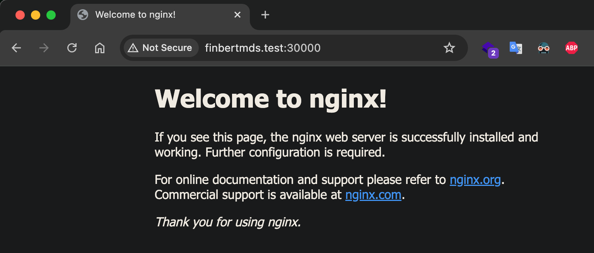

# Sử dụng Ingress, HAProxy Ingress

Giới thiệu và triển khai Ingress trong Kubernetes, dùng HAProxy Ingress Controller tiếp nhận các yêu cầu http, https đến cluster

## Ingress là gì

Ingress là thành phần được dùng để điều hướng các yêu cầu traffic giao thức HTTP và HTTPS từ bên ngoài (internet) vào các dịch vụ bên trong Cluster.

Ingress chỉ để phục vụ các cổng, yêu cầu HTTP, HTTPS còn các loại cổng khác, giao thức khác để truy cập được từ bên ngoài thì dùng Service với kiểu `NodePort` và `LoadBalancer`

Để Ingress hoạt động, hệ thống cần một điều khiển ingress trước (Ingress controller), có nhiều loại để chọn sử dụng (tham khảo [Ingress Controller](https://kubernetes.io/docs/concepts/services-networking/ingress-controllers/))

Nếu chọn Ngix Ingress Controller thì cài đặt theo: [NGINX Ingress Controller for Kubernetes](https://www.nginx.com/products/nginx-ingress-controller/).

Phần này, chọn loại [HAProxy Ingress](https://haproxy-ingress.github.io/)

## Cài đặt HAProxy Ingress Controller

Tham khảo [Install HAProxy Ingress Controller on premises](https://www.haproxy.com/documentation/kubernetes-ingress/community/installation/on-prem/)
```
helm repo add haproxytech https://haproxytech.github.io/helm-charts
helm repo update
helm install haproxy-kubernetes-ingress haproxytech/kubernetes-ingress \
  --create-namespace \
  --namespace haproxy-controller \
  --set controller.service.nodePorts.http=30000 \
  --set controller.service.nodePorts.https=30001 \
  --set controller.service.nodePorts.stat=30002
```


Kiểm tra các thành phần
```
kubectl get all -n haproxy-controller
```


Giờ các tên miền trỏ tới các IP của Node trong Cluster đã được điều khiển bởi Haproxy, ví dụ cấu hình một tên miền ảo (file `/etc/hosts` (Linux, macoS) hoặc `C:\Windows\System32\Drivers\etc\hosts` (Windows)), thêm vào tên miền ảo, giả sử `finbertmds.test` trỏ tới IP của một NODE nào đó
> 172.16.11.101 finbertmds.test

Giờ truy cập địa chỉ http://finbertmds.test:30000 hoặc https://finbertmds.test:30001 sẽ thấy `Not Found`


**Chú ý**
Với HA Proxy, tên miền có thể trỏ tới IP của node `master`.

Vì tên miền `finbertmds.test` chưa được cấu hình đến dịch vụ cụ thể nào, nó đã chuyển traffic do `service/ingress-default-backend` phục vụ.

## Tạo Ingress

### Triển khai ứng dụng http

1.app-test.yaml
```
apiVersion: v1
kind: Service
metadata:
  name: http-test-svc
  # dịch vụ này tạo tại namespace có Haproxy Ingress
  namespace: haproxy-controller
spec:
  ports:
  - port: 80
    protocol: TCP
    targetPort: 80
  selector:
    run: http-test-app
  sessionAffinity: None
  type: ClusterIP
---
apiVersion: apps/v1
kind: Deployment
metadata:
  labels:
    run: http-test-svc
  name: http-test-svc
  # Deploy này tạo tại namespace có Haproxy Ingress
  namespace: haproxy-controller
spec:
  replicas: 2
  selector:
    matchLabels:
      run: http-test-app
  template:
    metadata:
      labels:
        run: http-test-app
    spec:
      containers:
      - image: nginx
        imagePullPolicy: IfNotPresent
        name: http
        ports:
        - containerPort: 80
          protocol: TCP
        resources: {}
```

Triển khai
```
kubectl apply -f 1.app-test.yaml
```

File trên triển khai một ứng dụng từ image `nginx`, trong đó có tạo một service với tên `http-test-svc` để tương tác với các POD tạo ra.

Giờ ta sẽ tạo một Ingress để điều hướng traffic (http, https) vào dịch vụ này.

### Tạo Ingress

2.app-test-ingress.yaml
```
apiVersion: networking.k8s.io/v1
kind: Ingress
metadata:
  name: app
  namespace: haproxy-controller
spec:
  ingressClassName: haproxy
  rules:
  - host: "finbertmds.test"
    http:
      paths:
      - path: /
        pathType: Prefix
        backend:
          # dịch vụ phục vụ tương ứng với tên miền và path
          service:
            name: http-test-svc
            port:
              number: 80
```
Triển khai
```
kubectl apply -f 2.app-test-ingress.yaml
```
Giờ kiểm truy cập lại http://finbertmds.test:30000 sẽ thấy



2. HTTPS

## Tạo Ingress với cấu hình SSL (https)

Để cấu hình truy cập an toàn SSL, cần có các xác thực - các certs bạn mua, hoặc đăng ký miễn phí với https://letsencrypt.org/ cho tên miền cụ thể của bạn. Tuy nhiên để thực hành, sẽ sinh certs với openssl (tự xác thực - bị cảnh báo bởi trình duyệt).

Chạy lệnh sau để sinh xác thực cho tên miền ảo `finbertmds.test`

```
openssl req -x509 -newkey rsa:2048 -nodes -days 365 -keyout privkey.pem -out fullchain.pem -subj '/CN=finbertmds.test'
```

Sau đó tạo một Secret (thuộc namespace chạy POD), đặt tên Secret này là `finbertmds-test`

```
kubectl create secret tls finbertmds-test --cert=fullchain.pem --key=privkey.pem -n haproxy-controller
```

Xóa đi Ingress cũ
```
kubectl delete -f 2.app-test-ingress.yaml
```

Tạo lại một Ingress có thiết lập xác thực SSL với certs trên

3.app-test-ingress-ssl.yaml
```
apiVersion: networking.k8s.io/v1
kind: Ingress
metadata:
  name: app
  namespace: haproxy-controller
spec:
  ingressClassName: haproxy
  tls:
    - hosts:
      - finbertmds.test
      secretName: finbertmds-test
  rules:
  - host: finbertmds.test
    http:
      paths:
      - path: /
        pathType: Prefix
        backend:
          service:
            name: http-test-svc
            port:
              number: 80
```

Triển khai
```
kubectl apply -f 3.app-test-ingress-ssl.yaml
```

Giờ bạn đã có thể truy cập tới https://finbertmds.test:30001


## Clean up

```
helm uninstall -n haproxy-controller haproxy-kubernetes-ingress
kubectl delete ns/haproxy-controller
```
