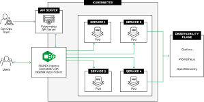
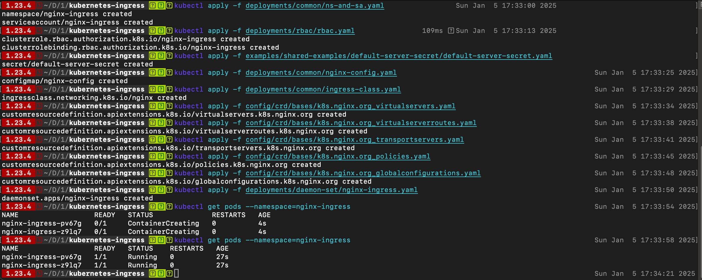
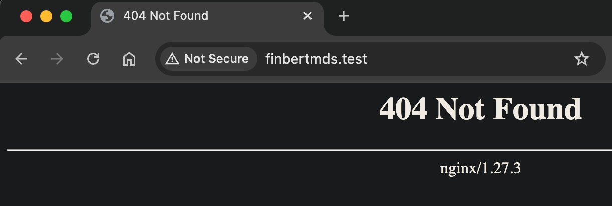
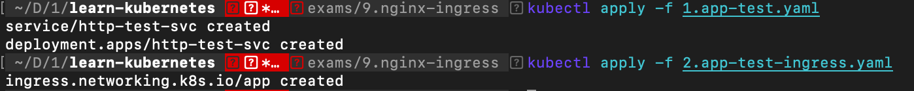
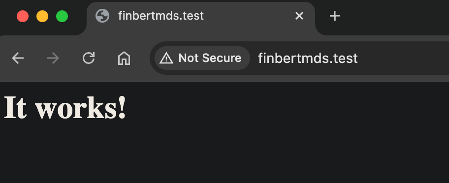
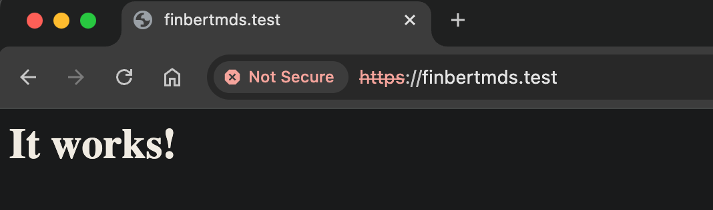

# Triển khai NGINX Ingress Controller

Triển khai và sử dụng NGINX Ingress Controller trong Kubernetes, ví dụ tạo Ingress chuyển hướng traffic http, https vào một dịch vụ trong Kubernetes

## NGINX Ingress Controller



NGINX Kubernetes Ingress Controller là một ingress hỗ trợ khả năng căn bằng tải, SSL, URI rewrite ...

[Ingress Controller](https://kubernetes.io/docs/concepts/services-networking/ingress-controllers/) được cung cấp bởi [Nginx](https://www.nginx.com/) là một proxy nổi tiếng, mã nguồn của Nginx Ingress Controller trên github tại: [nginxinc/kubernetes-ingress](https://github.com/nginxinc/kubernetes-ingress)

Hướng dẫn cài đặt cơ bản trên Document của nó tại: [installation-with-manifests](https://docs.nginx.com/nginx-ingress-controller/installation/installation-with-manifests/)

## Cài đặt NGINX Ingress Controller

Triển khai

```
git clone https://github.com/nginxinc/kubernetes-ingress.git
cd kubernetes-ingress

# Set up role-based access control (RBAC)
kubectl apply -f deployments/common/ns-and-sa.yaml
kubectl apply -f deployments/rbac/rbac.yaml

# Create common resources
kubectl apply -f examples/shared-examples/default-server-secret/default-server-secret.yaml
kubectl apply -f deployments/common/nginx-config.yaml
kubectl apply -f deployments/common/ingress-class.yaml

# Create core custom resources
kubectl apply -f config/crd/bases/k8s.nginx.org_virtualservers.yaml
kubectl apply -f config/crd/bases/k8s.nginx.org_virtualserverroutes.yaml
kubectl apply -f config/crd/bases/k8s.nginx.org_transportservers.yaml
kubectl apply -f config/crd/bases/k8s.nginx.org_policies.yaml
kubectl apply -f config/crd/bases/k8s.nginx.org_globalconfigurations.yaml

# Deploy NGINX Ingress Controller, Using a DaemonSet
kubectl apply -f deployments/daemon-set/nginx-ingress.yaml

# Confirm NGINX Ingress Controller is running
kubectl get pods --namespace=nginx-ingress
```



Giờ các tên miền trỏ tới các IP của Node trong Cluster đã được điều khiển bởi Haproxy, ví dụ cấu hình một tên miền ảo (file `/etc/hosts` (Linux, macoS) hoặc `C:\Windows\System32\Drivers\etc\hosts` (Windows)), thêm vào tên miền ảo, giả sử `finbertmds.test` trỏ tới IP của một NODE nào đó
> 172.16.11.101 finbertmds.test

Giờ truy cập địa chỉ http://finbertmds.test sẽ thấy `Not Found`



**Chú ý**
Với Nginx Ingress, tên miền không thể trỏ tới IP của node master, chỉ có thể trỏ tới IP của 2 node `worker`.

## Ví dụ tạo Ingress

Triển khai lại các vị dụ có trong phần [Sử dụng Ingress, HAProxy Ingress](K12_ingress_haproxy.md), nhưng chỉnh sửa lại một chút để dùng Nginx Ingress Controller

1.app-test.yaml
```apiVersion: v1
kind: Service
metadata:
  name: http-test-svc
  # dịch vụ này tạo tại namespace có Nginx Ingress
  namespace: nginx-ingress
spec:
  ports:
  - port: 80
    protocol: TCP
    targetPort: 80
  selector:
    run: http-test-app
  sessionAffinity: None
  type: ClusterIP
---
apiVersion: apps/v1
kind: Deployment
metadata:
  labels:
    run: http-test-svc
  name: http-test-svc
  # Deploy này tạo tại namespace có Nginx Ingress
  namespace: nginx-ingress
spec:
  replicas: 2
  selector:
    matchLabels:
      run: http-test-app
  template:
    metadata:
      labels:
        run: http-test-app
    spec:
      containers:
      - image: httpd
        imagePullPolicy: IfNotPresent
        name: http
        ports:
        - containerPort: 80
          protocol: TCP
        resources: {}
```

Tạo Ingress, chuyển hướng truy vấn vào ứng dụng trên khi truy cập bằng tên miền `finbertmds.test` với giao thức http

2.app-test-ingress.yaml
```
apiVersion: networking.k8s.io/v1
kind: Ingress
metadata:
  name: app
  namespace: nginx-ingress
spec:
  ingressClassName: nginx
  rules:
  - host: "finbertmds.test"
    http:
      paths:
      - path: /
        pathType: Prefix
        backend:
          # dịch vụ phục vụ tương ứng với tên miền và path
          service:
            name: http-test-svc
            port:
              number: 80
```

Triển khai
```
kubectl apply -f 1.app-test.yaml
kubectl apply -f 2.app-test-ingress.yaml
```



Hãy truy cập và kiểm tra từ trình duyệt đến địa chỉ http://finbertmds.test



Triển khai SSL truy cập bằng https, ở đây sử dụng chính các xác thực lưu trong Secret có tên `default-server-secret`, đi kèm Nginx Ingress Controller (hoặc tự tạo theo ví dụ trước).

3.app-test-ingress-ssl.yaml
```
apiVersion: networking.k8s.io/v1
kind: Ingress
metadata:
  name: app
  namespace: nginx-ingress
spec:
  ingressClassName: nginx
  tls:
    - hosts:
      - finbertmds.test
      secretName: default-server-secret
  rules:
  - host: finbertmds.test
    http:
      paths:
      - path: /
        pathType: Prefix
        backend:
          service:
            name: http-test-svc
            port:
              number: 80
```

Triển khai
```
kubectl delete -f 2.app-test-ingress.yaml
kubectl apply -f 3.app-test-ingress-ssl.yaml
```

Hãy truy cập và kiểm tra từ trình duyệt đến địa chỉ https://finbertmds.test/



## Clean up

```
cd kubernetes-ingress
kubectl delete namespace nginx-ingress
kubectl delete clusterrole nginx-ingress
kubectl delete clusterrolebinding nginx-ingress
kubectl delete -f deployments/common/ingress-class.yaml
kubectl delete -f config/crd/bases/k8s.nginx.org_virtualservers.yaml
kubectl delete -f config/crd/bases/k8s.nginx.org_virtualserverroutes.yaml
kubectl delete -f config/crd/bases/k8s.nginx.org_transportservers.yaml
kubectl delete -f config/crd/bases/k8s.nginx.org_policies.yaml
kubectl delete -f config/crd/bases/k8s.nginx.org_globalconfigurations.yaml
```
