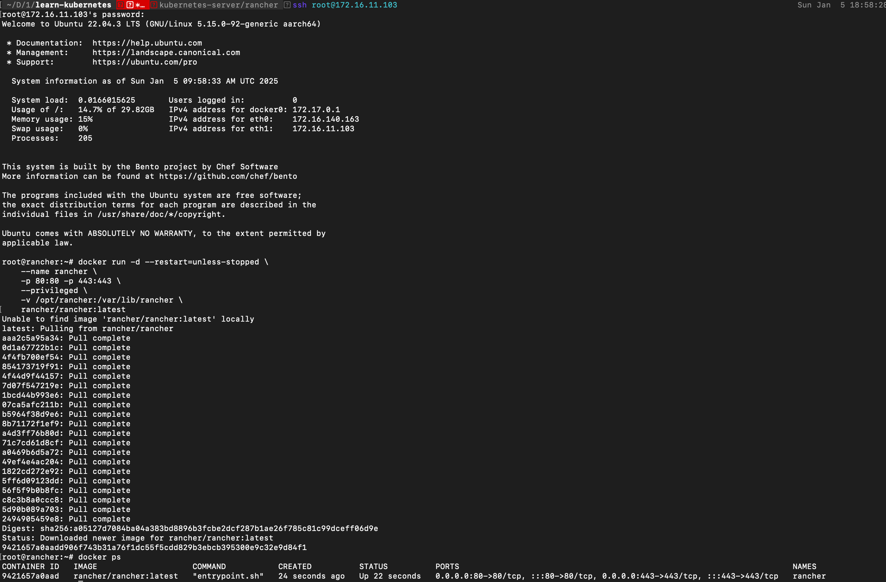
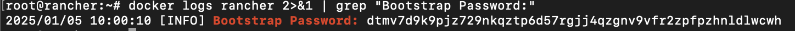
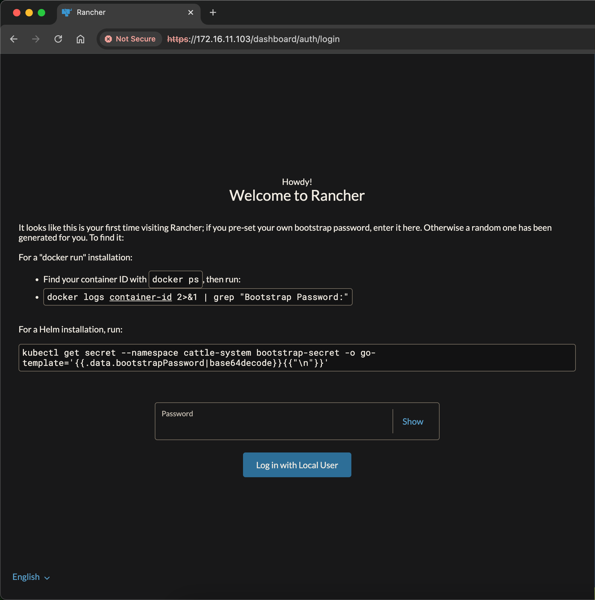
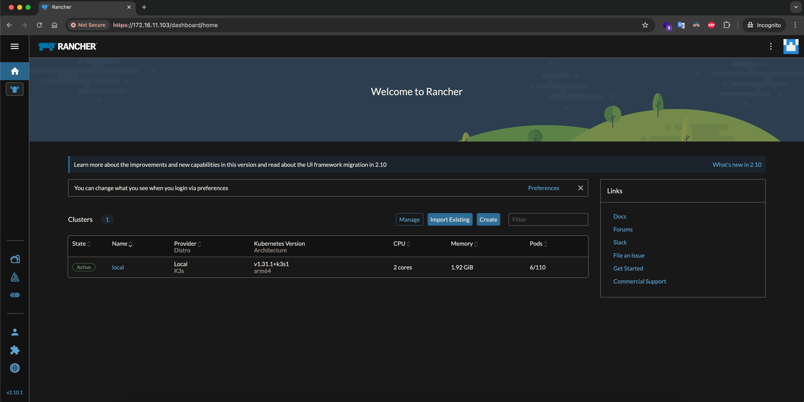
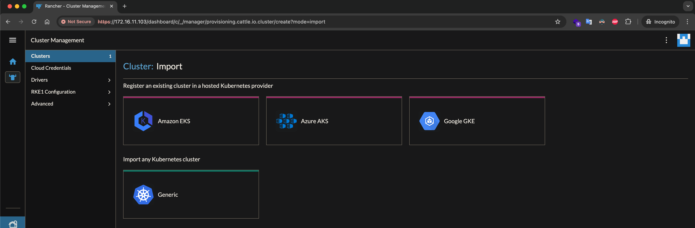
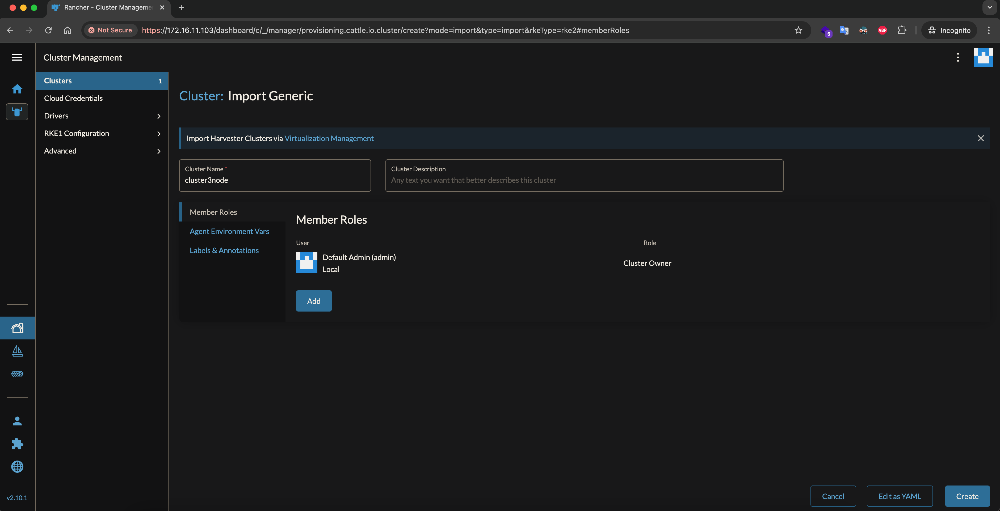
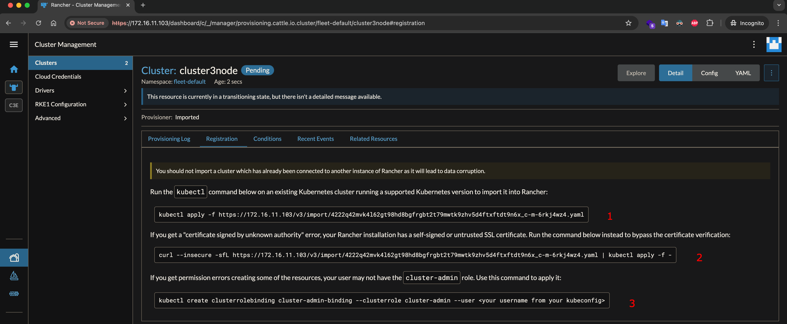
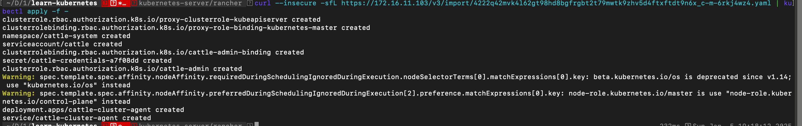
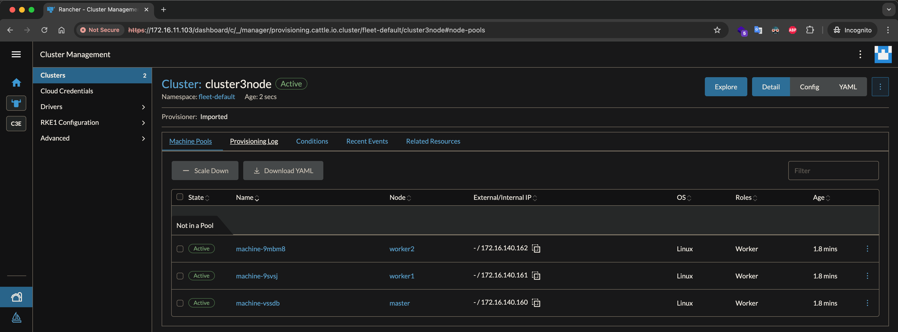

# Sử dụng Rancher để quản lý Kubernetes Cluster

Triển khai Rancher 2.x, sử dụng để quản lý các Cluster Kubernetes, thực hiện quản lý Cluster có sẵn và khởi tạo mới từ các dịch vụ như Kubernetes Engine của Google

## Giới thiệu và cài đặt Rancher

### Giới thiệu Rancher

Rancher 2.x là công cụ nguồn mở, giao diện nền web, để quản lý Kubernetes Cluster, triển khai ứng dụng trên Kubernetes cho dù Cluster của bạn chạy ở đâu, cung cấp bởi dịch vụ nào (AWS, GCP, Azure ...). Từ một Server cài đặt Rancher bạn có thể quản lý một hay nhiều Kubernetes Cluster trên cùng một giao diện.

Rancher 2.x cho phép bạn theo dõi, giám sát tình trạng của Kubernetes Cluster, nhận các cảnh báo về sử dụng tài nguyên ...

Để triển khai Rancher, bạn cần cài đặt Rancher trên một Server: gọi là Server Rancher, cần đảm bảo địa chỉ IP của Server Rancher và các Node của Kubernetes Cluster cần quản lý liên lạc mạng được với nhau!

Để nhanh chóng, có thể triển khai Rancher từ một Docker Host. Ở đây sử dụng lại Kubernetes Cluster có 3 node từ các ví dụ trước và Rancher Server sẽ triển khai chạy trên Docker của máy ảo có địa chỉ IP 172.16.11.103 Xem lại [Tạo Kubernetes Cluster 3 node](K01_k8s_intro_install.md#tạo-cluster-kubernetes-với-1-node-master-2-node-worker)

Vậy sẽ triển khai ví dụ này trên các máy ảo VirtualBox chạy CentOS gồm có:
| Hostname | Thông tin hệ thống                                     | Vai trò |
| -------- | ------------------------------------------------------ | ------- |
| master   | ubuntu-22.04, containerd, Kubernetes. IP 172.16.11.100 | master  |
| worker1  | ubuntu-22.04, containerd, Kubernetes. IP 172.16.11.101 | worker  |
| worker2  | ubuntu-22.04, containerd, Kubernetes. IP 172.16.11.102 | worker  |
| rancher  | ubuntu-22.04, Docker CE, Kubernetes. IP 172.16.11.103  | rancher |

### Cài đặt Rancher

SSH vào máy 172.16.11.103 (Ubuntu-22.04, đã có docker) và thực hiện lệnh:

```
docker run -d --restart=unless-stopped \
    --name rancher \
    -p 80:80 -p 443:443 \
    --privileged \
    -v /opt/rancher:/var/lib/rancher \
    rancher/rancher:latest
```



Để lấy password của user admin, chạy lệnh
```
docker logs rancher 2>&1 | grep "Bootstrap Password:"
```



Sau khi triển khai, truy cập vào địa chỉ https://172.16.11.103, màn hình đầu tiên nó yêu cầu bạn nhập password của user admin đã lấy ở trên



Sau đó nhập password mới và refresh trang để login vào dashboard.



## Thêm Cluster cần quản lý vào Rancher

Trước khi thêm cần đảm bảo tất cả các node của Cluster đều có thể kết nối mạng được đến Server Rancher

Từ Rancher, chọn **Clusters** > **Import Existing**, màn hình xuất hiện như dưới. Tùy thuộc vào Cluster triển khai từ dịch vụ nào thì chọn mục tương ứng, ví dụ Amazon EC2, Azure, GKE ..., với Cluster đã triển khai trên, sẽ chọn **Generic**



Màn hình tiếp theo, đặt tên cho Cluster quản lý, ví dụ: cluster3node. Ấn **Create** để tạo cluster



Cuối cùng là màn hình nó cung cấp các mã lệnh cần thực hiện tại Cluster bằng lệnh kubectl để kết nối.



Để triển các thành phần Rancher trên Cluster cần chạy mã lệnh (2).



Sau quá trình khởi tạo, kết nối trang chủ của Rancher có thông tin về Cluster nó quản lý


